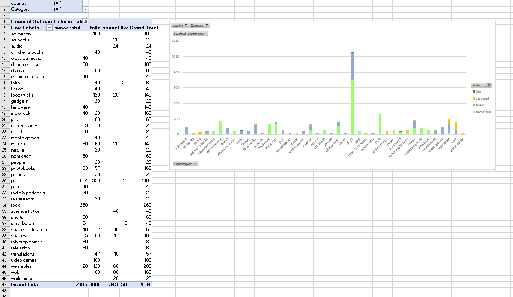

# Excel Challenge
In this basic Excel refresher, a dataset was supplied with Kickstarter funding data. The goal was to implement pivot tables and graphs, as well as create summary staistics to draw conclusions about the data. 

---

### Observations

1) Most Kickstarter campaigns originate in the US and have a higher rate of success. Non-US campaigns are about 50-50 on whether they succeed or not and, aside from Great Britain, are unsuccessful more often than not. 

2) Non-physical products make up a majority of the campaigns and the art community is heavily involved. Theater, music, and film make up 63% of campaigns and are the only categories to have a success rate of over 50%. This may also tie into the high barrier to entry in these categories. Producing music, films, and plays requires more time invested and financial commitment than making food, taking photographs, or writing might. 

3) December is the worst month to begin a campaign, with campaigns seeing almost 10% less success in December than on average, 5% lower than any other month. Campaigns do noticeably better in February through May.

### Limitations

Kickstart campaigns often provide incentives for backing certain amounts. It could be that campaigns without incentives, less incentives, or expensive tiers fail more often. Or possibly that campaigns with lots of incentives get cancelled as they promise too much for the money they raise. 

It’s also not uncommon for a company to kickstart more than one campaign. They could be 4 for 4 on delivering their product, or they could be 1 for 3 with a history of delays. While it may look any product in the “documentary” category is sure to be funded, they could all be from a single, well-respected company that produces high-quality documentaries and has an active fanbase that funds their projects.

There’s also not an explanation for some of these columns. By looking at their website, I can take a guess at what “staff pick” and “spotlight” are, but I don’t know what the difference is.

